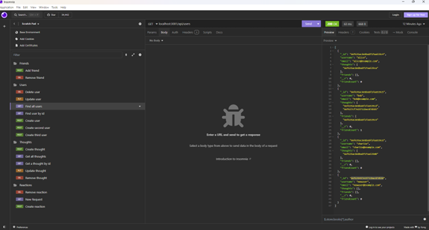

# Social Network API
by Heather Weltzien

## Table of Contents
* [Description](#description)
* [Installation](#installation)
* [Usage](#usage)
* [Credits](#credits)
* [License](#license)
    
## Description
   Social Network API is an API for a social network web application where users can share their thoughts, react to friends’ thoughts, and create a friend list. It features the use of Express.js for routing, a MongoDB database, and the Mongoose ODM. 

## Installation
    Run npm install and npm run seed in the terminal.
    
## Usage
    Run start in the terminal. Test API routes in Insomnia Core to create, update, and delete data in the database.

<a href="https://drive.google.com/file/d/1IbG4drQoTvgIizPrV_K4g1RoocEgwqy_/view" target="_blank">Link to walkthrough video</a>

    
## Credits
<ul>    
    <li>Tutoring session with Siddharth Shekhar</li>
    <li>Tutoring session with Nicholas Mtabo</li>
</ul>    

## License
    ISC